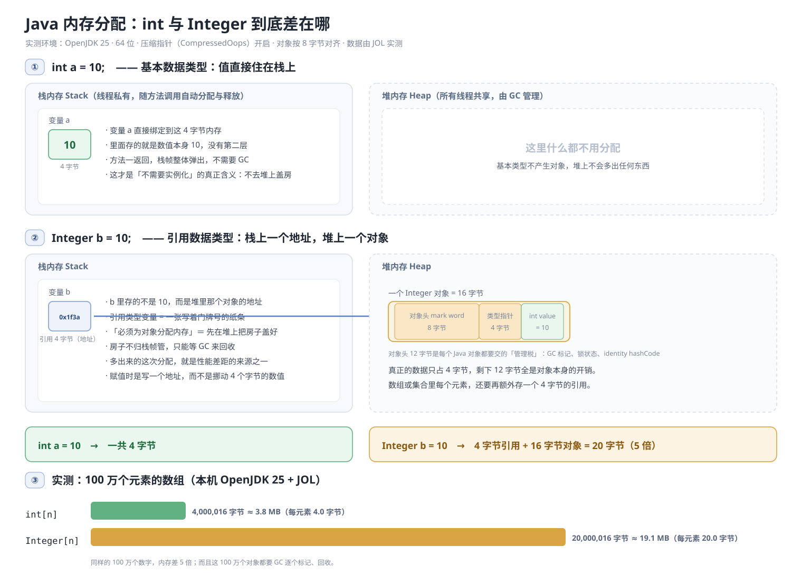
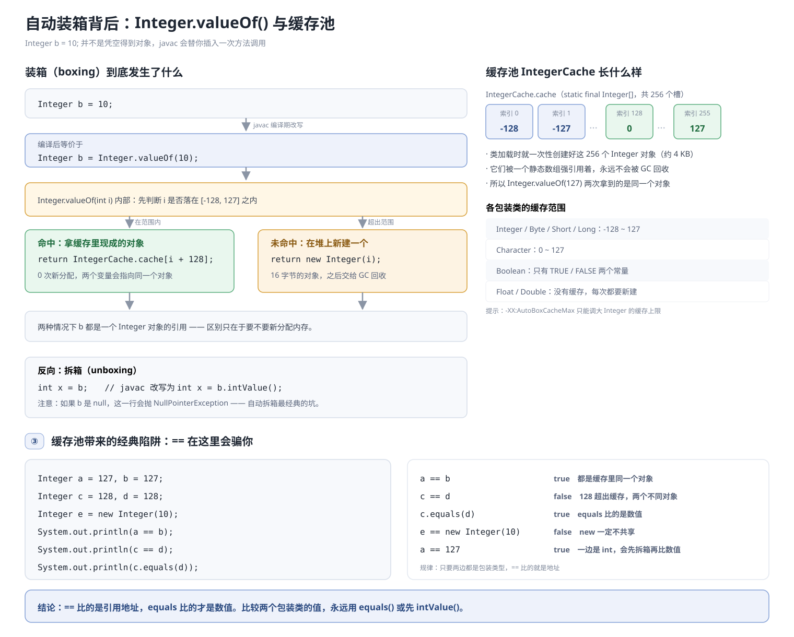

int 是基本数据类型
Integer 是一种引用类型。
基本数据类型是 Java 中最基本的数据类型，是预定义的，不需要实例化，这意味着不需要为对象进行内存分配。
而 Integer 必须为对象分配内存。性能方面，基本数据类型操作比引用类型快。

如果说「基本类型不需要内存分配」这句话，那么只对了一半：

- `int` **是要占内存的**，64 位 HotSpot 上就是 4 字节 —— 只是它跟着栈帧一起走；
- 它真正省掉的是**堆上的对象分配**：不 new 对象、不交 12 字节的对象头、不用 GC 管

**GC（Garbage Collector，垃圾回收）** 就是 JVM 自动帮我们找不再使用的对象，释放它们占用的堆内存，不用程序员手动写代码释放内存。

所以更准确的说法是：`int` 不需要为对象分配内存，`Integer` 需要。
下面三张图把「内存分配」这件事拆开看。

## 一、内存分配是什么：栈上放值，还是堆上盖房

要点：

- **栈（Stack）**：线程私有，方法一调用就分配、一返回就整体弹出。变量名直接绑定在一块内存上。
- **堆（Heap）**：所有线程共享，`new` 出来的对象都住这儿，生命周期不归方法管，只能等 GC 回收。
- `int a = 10;` —— 那 4 个字节里存的就是 `10` 本身，仅此而已。
- `Integer b = 10;` —— 栈上只有 4 个字节，存的是一个地址；真正的对象在堆上，由 **12 字节对象头 + 4 字节 int 数据 = 16 字节** 组成。

所谓「必须为对象分配内存」，指的就是后面这步：先在堆上把房子盖好，再把门牌号写回栈上的变量里。

## 二、`Integer b = 10;` 背后到底发生了什么（自动装箱和拆箱）

Integer 是 int 的包装类，可以实现自动装箱和拆箱
自动装箱：把 int 赋值给 Integer 引用变量，Integer b=10 只中，10 就是 int
自动拆箱：把 `Integer` 对象直接赋值给 `int` 变量

- `javac` 会在编译期把它改写成 `Integer.valueOf(10)` —— 这就是**自动装箱**。
- `valueOf` 先查 `[-128, 127]` 是否命中缓存池 `IntegerCache`：命中就直接返回现成对象（0 次分配），超出范围才 `new`。
- 反向的 `int x = b;` 会被改写成 `b.intValue()`，也就是**拆箱**；`b` 为 `null` 时会抛 `NullPointerException`。
- 所以 `Integer a = 127, b = 127; a == b` 是 `true`，而 `128` 却是 `false` —— `==` 比的是地址，不是数值。比较包装类的值请一律用 `equals()`。

## 三、那为什么还要有 Integer

因为 Java 里有一半的世界只认对象：

1. **泛型与集合**：`List<Integer>` 可以，`List<int>` 编译不过；
2. **表达「没有值」**：数据库可空列、查不到的结果，只有引用类型能写 `null`，`int` 只能拿 0 冒充；
3. **要放进 `Object` 的位置**：`Object[]`、反射、JSON 序列化、`Map` 的 key，基本类型递不进去；
4. **需要类型自带的工具**：`Integer.parseInt`、`Integer.MAX_VALUE`、`Integer.toBinaryString`；
5. **要参与多态**：`Number` 让 `Integer/Long/Double` 有了共同父类，基本类型没有继承关系。

代价也必须认：内存约 5 倍、GC 多扫一堆对象、CPU 缓存不友好、`==` 和拆箱 NPE 两个坑。

## 小林 Coding 中的资料问题：

### Q1：int 和 Integer 区别是什么：

- 基本类型和引用类型
- 自动装箱和自动拆箱
- 空指针异常：int 变量默认值为 0，Integer 作为引用类型默认值为 null，如果对一个值为 null 的 Integer 执行自动拆箱操作，就会抛出空指针异常，因为 null 无法被拆箱为基本类型

### Q2：为什么要保留 int 类型

包装类是引用类型，对象的引用和对象本身是分开存储的，而对于基本类型数据，变量对应的内存块直接存储数据本身。因此，基本类型数据在读写效率方面，要比包装类高效。

除此之外，在 64 位 JVM 上，在开启引用压缩的情况下，一个 Integer 对象占用 16 个字节的内存空间（可以看前面那个堆栈示意图），而一个 int 类型数据只占用 4 字节的内存空间，前者对空间的占用是后者的 4 倍。

也就是说，不管是读写效率，还是存储效率，基本类型都比包装类高效。

### Q3：说一下 integer 的缓存：

Java 的 Integer 类内部实现了一个静态缓存池，用于存储特定范围内的整数值对应的 Integer 对象。

默认情况下，这个范围是 - 128 至 127。当通过 Integer.valueOf (int) 方法创建一个在这个范围内的整数对象时，并不会每次都生成新的对象实例，而是复用缓存中的现有对象，会直接从内存中取出，不需要新建一个对象。

