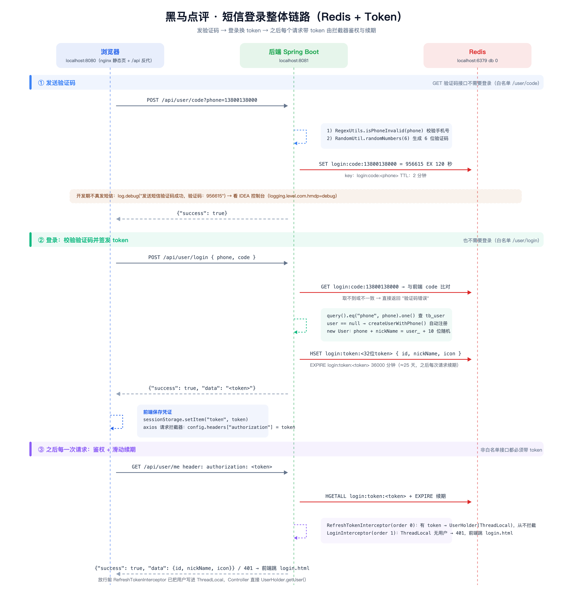
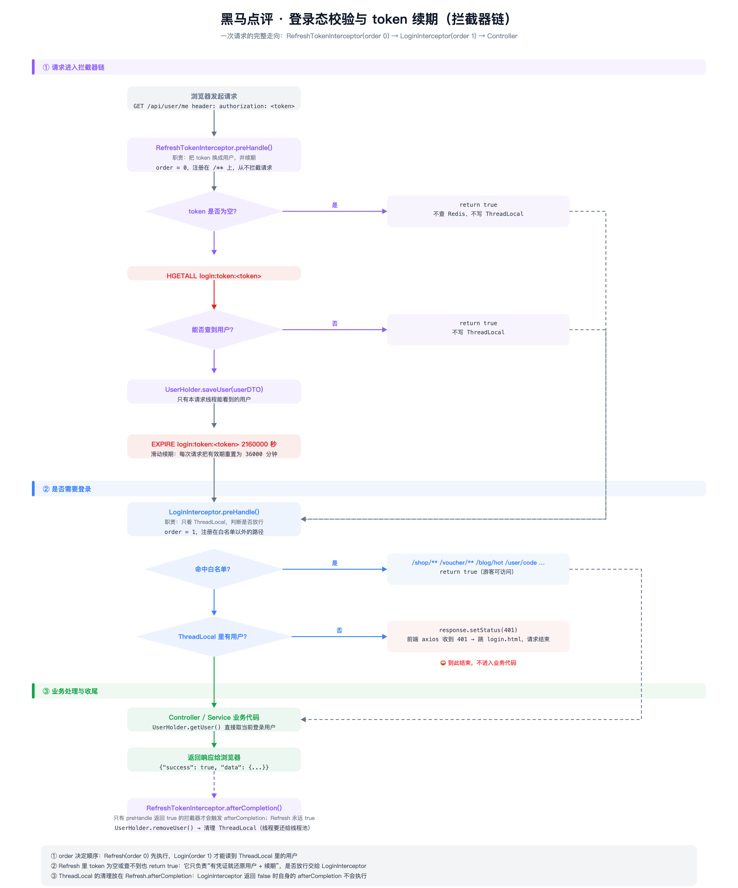

# 黑马点评 · 短信登录模块（代码 + 业务逻辑 + 业务流程）

> 对应代码：`~/Desktop/hm-dianping/hm-dianping`
> 整理时间：2026-09-24　覆盖范围：**发验证码 → 登录换 token → 登录态识别 → token 续期** 的全部现有代码

---

## 一、模块概览

### 1.1 这个模块做了什么

用户在前端输入手机号 → 后端生成验证码并缓存到 Redis → 用户输入验证码登录 → 校验通过后签发一个 token 存入 Redis 并返回前端 → 之后前端每次请求都带着这个 token，后端在拦截器里据此识别用户身份，并把 token 的有效期顺延。

服务端不使用 HttpSession 保存登录状态，而是把用户信息放在 Redis 里，用 token 作为 key —— 这样多个服务实例都能读到同一份登录状态。

### 1.2 涉及的文件

| 层 | 文件（相对项目根目录） | 作用 |
|---|---|---|
| 控制层 | `src/main/java/com/hmdp/controller/UserController.java` | 暴露验证码、登录、当前用户、登出接口 |
| 服务接口 | `src/main/java/com/hmdp/service/IUserService.java` | 定义 `sendCode`、`login` |
| 服务实现 | `src/main/java/com/hmdp/service/impl/UserServiceImpl.java` | 本模块的全部业务逻辑 |
| 数据层 | `src/main/java/com/hmdp/mapper/UserMapper.java` | MyBatis-Plus 的 `BaseMapper<User>`，无自定义 SQL |
| 实体 | `src/main/java/com/hmdp/entity/User.java` | 对应 `tb_user` 表 |
| 传输对象 | `src/main/java/com/hmdp/dto/LoginFormDTO.java` | 登录入参 |
| 传输对象 | `src/main/java/com/hmdp/dto/UserDTO.java` | 精简用户（不含密码），存 Redis、返回前端都用它 |
| 传输对象 | `src/main/java/com/hmdp/dto/Result.java` | 统一返回体 |
| 拦截器 | `src/main/java/com/hmdp/utils/RefreshTokenInterceptor.java` | token 换用户 + 续期，从不拦截 |
| 拦截器 | `src/main/java/com/hmdp/utils/LoginInterceptor.java` | 判断是否需要登录 |
| 拦截器注册 | `src/main/java/com/hmdp/config/MvcConfig.java` | 注册两个拦截器、配置白名单 |
| 用户上下文 | `src/main/java/com/hmdp/utils/UserHolder.java` | 基于 `ThreadLocal` 保存当前请求的用户 |
| 常量 | `src/main/java/com/hmdp/utils/RedisConstants.java` | Redis key 前缀与过期时间 |
| 校验工具 | `src/main/java/com/hmdp/utils/RegexUtils.java`、`utils/RegexPatterns.java` | 手机号等格式校验 |
| 常量 | `src/main/java/com/hmdp/utils/SystemConstants.java` | 新用户昵称前缀 `user_` |
| 全局异常 | `src/main/java/com/hmdp/config/WebExceptionAdvice.java` | 统一把异常转成 `{"errorMsg":"服务器异常"}` |
| 配置 | `src/main/resources/application.yaml` | 端口、MySQL、Redis、日志级别 |
| 前端 | `html/hmdp/js/common.js`、`html/hmdp/login.html` | 发送验证码、登录、携带 token |

### 1.3 接口清单

| 方法 | 前端请求路径 | 后端实际路径 | 入参 | 返回 |
|---|---|---|---|---|
| POST | `/api/user/code?phone=手机号` | `/user/code` | query 参数 `phone` | `{"success":true}` |
| POST | `/api/user/login` | `/user/login` | JSON：`{phone, code}` | `{"success":true,"data":"<token>"}` |
| GET | `/api/user/me` | `/user/me` | 请求头 `authorization: <token>` | `{"success":true,"data":{id,nickName,icon}}` |
| POST | `/api/user/logout` | `/user/logout` | — | 当前返回 `{"success":false,"errorMsg":"功能未完成"}` |
| GET | `/api/user/info/{id}` | `/user/info/{id}` | 路径参数 `id` | 用户详情 |

前端访问 8080（nginx），nginx 把 `/api/xxx` 重写成 `/xxx` 后反向代理到后端的 8081。

---

## 二、业务流程

### 2.1 整体链路图



文本版：

```
浏览器(8080 nginx)                 后端(8081 Spring Boot)               Redis
      │                                   │                              │
      │ 1. POST /api/user/code?phone=xxx  │                              │
      ├──────────────────────────────────►│ UserController.sendCode      │
      │                                   ├─ 正则校验手机号              │
      │                                   ├─ 生成 6 位验证码            │
      │                                   ├─ SET login:code:xxx = 123456 ──►  (TTL 2 分钟)
      │                                   ├─ log.debug 打印验证码（开发期代替短信）
      │◄──────── {"success":true} ────────┤                              │
      │                                   │                              │
      │ 2. POST /api/user/login {phone,code}                             │
      ├──────────────────────────────────►│ UserController.login         │
      │                                   ├─ GET login:code:xxx ◄──────────┤
      │                                   ├─ 与前端传来的 code 比对       │
      │                                   ├─ 按 phone 查 tb_user          │
      │                                   ├─ 查不到 → 自动注册新用户      │
      │                                   ├─ 生成 token                  │
      │                                   ├─ HSET login:token:token ──────►  (id/nickName/icon)
      │                                   ├─ EXPIRE login:token:token ────►  (TTL 36000 分钟)
      │◄──────── {"success":true,"data":"<token>"} ─┤                    │
      │ 3. sessionStorage.setItem("token", token)                        │
      │                                   │                              │
      │ 4. 之后每个请求自动带 authorization 头                           │
      ├──────────────────────────────────►│ RefreshTokenInterceptor      │
      │                                   ├─ HGETALL login:token:token ◄───┤
      │                                   ├─ 有 → UserHolder(ThreadLocal)  │
      │                                   ├─ EXPIRE 续期 ────────────────►│
      │                                   │ LoginInterceptor             │
      │                                   ├─ ThreadLocal 里没用户 → 401   │
      │◄──── 401 → 前端跳 login.html ─────┤                              │
```

### 2.2 分阶段说明

**阶段一：发送验证码**

1. 前端 `login.html` 点"发送验证码"，请求 `POST /api/user/code?phone=手机号`；
2. `UserController.sendCode` 把手机号交给 `UserServiceImpl.sendCode`；
3. 先用正则校验手机号格式，不合法直接返回 `手机格式错误！`；
4. `RandomUtil.randomNumbers(6)` 生成 6 位数字验证码；
5. 以 `login:code:<手机号>` 为 key 存进 Redis，过期时间 2 分钟；
6. 开发阶段不接短信服务商，用 `log.debug` 把验证码打印到控制台（需要 `logging.level.com.hmdp=debug`）；
7. 返回 `{"success":true}`。

**阶段二：登录**

1. 前端把手机号和验证码 POST 到 `/api/user/login`，body 是 `{"phone":"...","code":"..."}`；
2. `UserServiceImpl.login` 先校验手机号格式；
3. 用 `login:code:<手机号>` 从 Redis 取出验证码，与前端提交的比对：取不到或不一致 → 返回 `验证码错误`；
4. 用手机号查 `tb_user`（`query().eq("phone", phone).one()`）；
5. 查不到 → `createUserWithPhone` 自动注册：设置手机号 + 随机昵称（`user_` + 10 位随机字符串）后插入；
6. `UUID.randomUUID().toString(true)` 生成 32 位 token；
7. `User` → `UserDTO` → `Map`，以 `login:token:<token>` 为 key 写入 Redis Hash，字段为 `id`、`nickName`、`icon`；
8. 给这个 key 设置 36000 分钟（25 天）的过期时间；
9. 返回 token 给前端，前端存进 `sessionStorage`。

**阶段三：后续请求的登录态识别与续期**

1. 前端 `common.js` 的请求拦截器把 token 放进请求头 `authorization`；
2. 请求到达后端，先走 `RefreshTokenInterceptor`（`order 0`）：
   - 取 `authorization` 头；为空 → 直接放行；
   - 不为空 → `HGETALL login:token:<token>` 查 Redis；查不到 → 直接放行；
   - 查到 → `BeanUtil.fillBeanWithMap` 转成 `UserDTO`，存进 `UserHolder`（`ThreadLocal`）；再把该 key 的过期时间重置为 36000 分钟（续期）；放行；
3. 再走 `LoginInterceptor`（`order 1`）：只看 `UserHolder.getUser()`；
   - 有用户 → 放行，进入 Controller；
   - 没有用户 → `response.setStatus(401)`，请求结束；
4. 业务代码通过 `UserHolder.getUser()` 直接拿到当前登录用户，不再查库、不再解析 token；
5. 请求结束后，`RefreshTokenInterceptor.afterCompletion` 执行 `UserHolder.removeUser()` 清理 `ThreadLocal`。

### 2.3 单次请求在拦截器链里的控制流



---

## 三、Redis 数据结构

| 用途 | Key | 类型 | 字段 / 值示例 | 过期时间 |
|---|---|---|---|---|
| 登录验证码 | `login:code:13800138000` | String | `956615` | 2 分钟（`LOGIN_CODE_TTL`） |
| 登录用户 | `login:token:cd5ad93a378b4faea8b09d83673c0600` | Hash | `id=1013`、`nickName=user_ewmd5utwtx`、`icon=` | 36000 分钟（`LOGIN_USER_TTL`），每次请求被重置 |

常量定义在 `RedisConstants`：

```java
public static final String LOGIN_CODE_KEY = "login:code:";
public static final Long   LOGIN_CODE_TTL = 2L;        // 分钟
public static final String LOGIN_USER_KEY = "login:token:";
public static final Long   LOGIN_USER_TTL = 36000L;    // 分钟，约 25 天
```

命令行查看：

```bash
redis-cli -h 127.0.0.1 -p 6379 -a 123456 --no-auth-warning keys 'login:*'
redis-cli -h 127.0.0.1 -p 6379 -a 123456 --no-auth-warning get  login:code:13800138000
redis-cli -h 127.0.0.1 -p 6379 -a 123456 --no-auth-warning hgetall login:token:<token>
redis-cli -h 127.0.0.1 -p 6379 -a 123456 --no-auth-warning ttl login:token:<token>
```

---

## 四、代码逐层讲解

### 4.1 `UserController`

```java
@Slf4j
@RestController
@RequestMapping("/user")
public class UserController {

    @Resource
    private IUserService userService;

    /** 发送手机验证码 */
    @PostMapping("code")
    public Result sendCode(@RequestParam("phone") String phone, HttpSession session) {
        return userService.sendCode(phone, session);
    }

    /** 登录功能：参数包含手机号、验证码 */
    @PostMapping("/login")
    public Result login(@RequestBody LoginFormDTO loginForm, HttpSession session) {
        return userService.login(loginForm, session);
    }

    /** 登出功能：尚未实现 */
    @PostMapping("/logout")
    public Result logout() {
        return Result.fail("功能未完成");
    }

    /** 获取当前登录用户 */
    @GetMapping("/me")
    public Result me() {
        UserDTO user = UserHolder.getUser();   // 拦截器已经放进 ThreadLocal
        return Result.ok(user);
    }
}
```

要点：
- `sendCode` 用 `@RequestParam`，所以手机号走 query 参数；`login` 用 `@RequestBody`，所以用 JSON。
- `me()` 不查 Redis、不查库，直接读 `ThreadLocal`。
- `HttpSession session` 参数目前没有实际使用（早期基于 Session 的写法遗留）。

### 4.2 `LoginFormDTO` / `UserDTO` / `Result`

```java
@Data
public class LoginFormDTO {          // 登录表单
    private String phone;
    private String code;
    private String password;
}

@Data
public class UserDTO {               // 存 Redis、返回前端的精简用户
    private Long   id;
    private String nickName;
    private String icon;
}

@Data @NoArgsConstructor @AllArgsConstructor
public class Result {                // 统一返回体
    private Boolean success;
    private String  errorMsg;
    private Object  data;
    private Long    total;

    public static Result ok()                  { return new Result(true,  null, null, null); }
    public static Result ok(Object data)       { return new Result(true,  null, data, null); }
    public static Result ok(List<?> d, Long t) { return new Result(true,  null, d,    t);    }
    public static Result fail(String errorMsg) { return new Result(false, errorMsg, null, null); }
}
```

用 `UserDTO` 而不是直接存 `User`，是为了不把密码写进 Redis、也不返回给前端。

### 4.3 `UserServiceImpl.sendCode`

```java
@Override
public Result sendCode(String phone, HttpSession session) {
    // 1. 校验手机号
    if (RegexUtils.isPhoneInvalid(phone)) {
        return Result.fail("手机格式错误！");
    }
    // 2. 生成 6 位数字验证码
    String code = RandomUtil.randomNumbers(6);

    // 3. 保存验证码到 Redis：key = login:code:手机号，有效期 2 分钟
    stringRedisTemplate.opsForValue().set(
            RedisConstants.LOGIN_CODE_KEY + phone, code,
            RedisConstants.LOGIN_CODE_TTL, TimeUnit.MINUTES);

    // 4. 发送验证码（开发阶段用日志代替真实短信）
    log.debug("发送短信验证码成功，验证码：" + code);
    return Result.ok();
}
```

说明：
- 这里的 `log` 来自 MyBatis-Plus `ServiceImpl` 里的 `protected Log log`，不是 Lombok 的 `@Slf4j`，所以类上没有加该注解也能用。
- 同一个手机号反复获取验证码时，新值会覆盖旧值。
- 手机号正则定义在 `RegexPatterns.PHONE_REGEX`，由 `RegexUtils.isPhoneInvalid` 调用。

### 4.4 `UserServiceImpl.login`

```java
@Override
public Result login(LoginFormDTO loginForm, HttpSession session) {
    // 1. 校验手机号
    String phone = loginForm.getPhone();
    if (RegexUtils.isPhoneInvalid(phone)) {
        return Result.fail("手机格式错误！");
    }

    // 2. 校验验证码：从 Redis 取出来与前端提交的比对
    String cacheCode = stringRedisTemplate.opsForValue().get(RedisConstants.LOGIN_CODE_KEY + phone);
    String code = loginForm.getCode();
    if (cacheCode == null || !cacheCode.equals(code)) {
        return Result.fail("验证码错误");
    }

    // 3. 按手机号查询用户
    User user = query().eq("phone", phone).one();

    // 4. 用户不存在则自动注册
    if (user == null) {
        user = createUserWithPhone(phone);
    }

    // 5. 生成 token（UUID 去掉横线，32 位）
    String token = UUID.randomUUID().toString(true);

    // 6. User → UserDTO，再把 DTO 转成 Map
    UserDTO userDTO = new UserDTO();
    BeanUtils.copyProperties(user, userDTO);

    Map<String, Object> userMap = BeanUtil.beanToMap(userDTO, new HashMap<>(),
            CopyOptions.create()
                    .setIgnoreNullValue(true)                              // 先跳过 null，避免下面 NPE
                    .setFieldValueEditor((fieldName, fieldValue) -> fieldValue.toString())); // 全部转成字符串

    // 7. 以 token 为 key 写入 Redis Hash，并设置过期时间
    String tokenKey = RedisConstants.LOGIN_USER_KEY + token;
    stringRedisTemplate.opsForHash().putAll(tokenKey, userMap);
    stringRedisTemplate.expire(tokenKey, RedisConstants.LOGIN_USER_TTL, TimeUnit.MINUTES);

    // 8. token 返回给前端保存
    return Result.ok(token);
}
```

**为什么第 6 步要加 `CopyOptions`：** `UserDTO` 的 `id` 是 `Long`，直接 `BeanUtil.beanToMap(userDTO)` 得到的 Map 里 `id` 是 `Long`；而 `StringRedisTemplate` 的 Hash 值序列化器是 `StringRedisSerializer`，只接受字符串，写 `Long` 会抛：

```
java.lang.ClassCastException: java.lang.Long cannot be cast to java.lang.String
    at org.springframework.data.redis.serializer.StringRedisSerializer.serialize
    at org.springframework.data.redis.core.DefaultHashOperations.putAll
    at com.hmdp.service.impl.UserServiceImpl.login(UserServiceImpl.java:104)
```

这个异常会被 `WebExceptionAdvice` 捕获，前端只看到 `服务器异常`。加上 `setFieldValueEditor(...toString())` 后所有字段都是字符串，问题解决。

### 4.5 `UserServiceImpl.createUserWithPhone`

```java
private User createUserWithPhone(String phone) {
    User user = new User();
    user.setPhone(phone);
    user.setNickName(SystemConstants.USER_NICK_NAME_PREFIX + RandomUtil.randomString(10)); // user_ + 10 位随机
    save(user);      // MyBatis-Plus 插入，@TableId(AUTO) 会把自增主键回填到 user.id
    return user;
}
```

### 4.6 `UserHolder`：当前请求的用户

```java
public class UserHolder {
    private static final ThreadLocal<UserDTO> tl = new ThreadLocal<>();

    public static void saveUser(UserDTO user) { tl.set(user); }
    public static UserDTO getUser()           { return tl.get(); }
    public static void removeUser()           { tl.remove(); }
}
```

一个 HTTP 请求由一个 Tomcat 线程处理，用 `ThreadLocal` 可以把用户和线程绑定，业务代码随处可取。请求结束必须 `removeUser()`，否则线程被复用时会残留上一个用户的数据。

### 4.7 `RefreshTokenInterceptor`：token 换用户 + 续期

```java
public class RefreshTokenInterceptor implements HandlerInterceptor {

    private StringRedisTemplate stringRedisTemplate;

    public RefreshTokenInterceptor(StringRedisTemplate stringRedisTemplate) {
        this.stringRedisTemplate = stringRedisTemplate;    // 手动 new 的拦截器，用构造器传入
    }

    @Override
    public boolean preHandle(HttpServletRequest request, HttpServletResponse response, Object handler) {
        // 1. 取请求头里的 token
        String token = request.getHeader("authorization");

        // 2. 没有 token：放行
        if (StrUtil.isBlank(token)) {
            return true;
        }

        // 3. 用 token 去 Redis 取出整份用户 Hash
        Map<Object, Object> userMap =
                stringRedisTemplate.opsForHash().entries(RedisConstants.LOGIN_USER_KEY + token);

        // 4. 查不到（token 无效或已过期）：放行
        if (userMap.isEmpty()) {
            return true;
        }

        // 5. Hash → UserDTO
        UserDTO userDTO = BeanUtil.fillBeanWithMap(userMap, new UserDTO(), false);

        // 6. 保存到 ThreadLocal
        UserHolder.saveUser(userDTO);

        // 7. 续期：把有效期重置回 36000 分钟
        stringRedisTemplate.expire(RedisConstants.LOGIN_USER_KEY + token,
                RedisConstants.LOGIN_USER_TTL, TimeUnit.MINUTES);

        // 8. 放行
        return true;
    }

    @Override
    public void afterCompletion(HttpServletRequest request, HttpServletResponse response,
                                Object handler, @Nullable Exception ex) {
        // 9. 请求结束清理 ThreadLocal
        UserHolder.removeUser();
    }
}
```

两个特点：
- 它在任何情况下都 `return true`，从不阻断请求，只负责"有有效凭证就把用户还原出来"；
- 每次命中都执行一次 `EXPIRE`，所以只要用户在有效期内有请求，登录状态就一直延续（滑动过期）。

### 4.8 `LoginInterceptor`：判断是否需要登录

```java
public class LoginInterceptor implements HandlerInterceptor {

    @Override
    public boolean preHandle(HttpServletRequest request, HttpServletResponse response, Object handler) {
        // ThreadLocal 里没有用户 → 未登录
        if (UserHolder.getUser() == null) {
            response.setStatus(401);
            return false;
        }
        return true;
    }
}
```

它只看 `ThreadLocal`，不查 Redis，因为 `RefreshTokenInterceptor` 已经查过了。

### 4.9 `MvcConfig`：注册顺序与白名单

```java
@Configuration
public class MvcConfig implements WebMvcConfigurer {

    @Resource
    private StringRedisTemplate stringRedisTemplate;

    @Override
    public void addInterceptors(InterceptorRegistry registry) {
        // order 1：需要登录的接口（白名单除外）
        registry.addInterceptor(new LoginInterceptor())
                .excludePathPatterns(
                        "/shop/**",
                        "/voucher/**",
                        "/upload/**",
                        "/blog/hot",
                        "/user/code",
                        "/user/login"
                ).order(1);

        // order 0：刷新 token、还原用户；不指定路径 = 对所有路径生效
        registry.addInterceptor(new RefreshTokenInterceptor(stringRedisTemplate)).order(0);
    }
}
```

两个要点：
- `order` 决定执行顺序，数值小的先执行。`RefreshTokenInterceptor` 是 `0`，`LoginInterceptor` 是 `1`，所以"先还原用户，再判断要不要拦截"。
- `afterCompletion` 只会被 `preHandle` 返回 `true` 的拦截器触发。`RefreshTokenInterceptor` 永远返回 `true`，所以它的清理逻辑一定会执行；把 `removeUser()` 放在它这里是可靠的。

### 4.10 `WebExceptionAdvice`：异常统一出口

```java
@Slf4j
@RestControllerAdvice
public class WebExceptionAdvice {

    @ExceptionHandler(RuntimeException.class)
    public Result handleRuntimeException(RuntimeException e) {
        log.error(e.toString(), e);      // 完整堆栈打印在后端控制台
        return Result.fail("服务器异常"); // 前端只能看到这一句
    }
}
```

所以前端出现"服务器异常"时，真正原因要去 IDEA 控制台看这一行的 `Caused by`。

### 4.11 数据层与配置

```java
// 启动类：扫描 Mapper
@MapperScan("com.hmdp.mapper")
@SpringBootApplication
public class HmDianPingApplication {
    public static void main(String[] args) { SpringApplication.run(HmDianPingApplication.class, args); }
}

// Mapper：直接用 MyBatis-Plus 的通用方法，无需写 SQL
public interface UserMapper extends BaseMapper<User> { }
```

```java
@TableName("tb_user")
public class User {
    @TableId(value = "id", type = IdType.AUTO) private Long id;   // 自增主键，插入后回填
    private String phone;
    private String password;
    private String nickName;
    private String icon = "";                                     // 默认空串
    private LocalDateTime createTime;
    private LocalDateTime updateTime;
}
```

`application.yaml`（本机运行配置）：

```yaml
server:
  port: 8081
spring:
  application:
    name: hmdp
  datasource:
    driver-class-name: com.mysql.cj.jdbc.Driver
    url: jdbc:mysql://127.0.0.1:3306/hmdp?useSSL=false&serverTimezone=UTC&allowPublicKeyRetrieval=true&characterEncoding=utf8
    username: root
    password: 123456
  redis:
    host: 127.0.0.1
    port: 6379
    password: 123456
    lettuce:
      pool:
        max-active: 10
        max-idle: 10
        min-idle: 1
        time-between-eviction-runs: 10s
  jackson:
    default-property-inclusion: non_null
mybatis-plus:
  type-aliases-package: com.hmdp.entity
logging:
  level:
    com.hmdp: debug     # 这行决定验证码能不能打印到控制台
```

---

## 五、前端配合

### 5.1 `common.js`：自动带 token、处理 401

```js
let token = sessionStorage.getItem("token");

// 请求拦截器：每个请求都带上 authorization 头
axios.interceptors.request.use(config => {
  if (token) config.headers['authorization'] = token;
  return config;
});

// 响应拦截器：统一处理业务失败与 401
axios.interceptors.response.use(
  response => {
    if (!response.data.success) return Promise.reject(response.data.errorMsg);
    return response.data;
  },
  error => {
    if (error.response.status == 401) {                       // 未登录
      setTimeout(() => { location.href = "/login.html"; }, 200);
      return Promise.reject("请先登录");
    }
    return Promise.reject("服务器异常");
  }
);
```

约定：
- 请求头名字固定为 `authorization`，与后端 `request.getHeader("authorization")` 对应；
- token 存在 `sessionStorage`，关闭标签页即失效；
- 后端返回 401 时前端自动跳登录页。

### 5.2 `login.html`：发送验证码与登录

```js
// 发送验证码
axios.post("/user/code?phone=" + this.form.phone).then(() => {});

// 登录：成功后把 token 存起来并跳首页
axios.post("/user/login", this.form)          // this.form = {phone, code}
  .then(({ data }) => {
    if (data) sessionStorage.setItem("token", data);
    location.href = "/index.html";
  })
  .catch(err => this.$message.error(err));
```

---

## 六、实测记录

应用跑在 8081，Redis 密码 123456，以下命令可直接复现：

```bash
# 1) 发送验证码
curl -X POST "http://127.0.0.1:8081/user/code?phone=13900001112"
# {"success":true}

# 2) 从 Redis 取验证码（开发期代替收短信）
redis-cli -h 127.0.0.1 -p 6379 -a 123456 --no-auth-warning get login:code:13900001112
# "464150"

# 3) 登录
curl -X POST "http://127.0.0.1:8081/user/login" -H "Content-Type: application/json" \
     -d '{"phone":"13900001112","code":"464150"}'
# {"success":true,"data":"cd5ad93a378b4faea8b09d83673c0600"}

# 4) 查看 Redis 里的用户数据
redis-cli -h 127.0.0.1 -p 6379 -a 123456 --no-auth-warning hgetall login:token:cd5ad93a378b4faea8b09d83673c0600
# id       -> 1013
# nickName -> user_ewmd5utwtx
# icon     -> (空串)

# 5) 带 token 访问需要登录的接口
curl "http://127.0.0.1:8081/user/me" -H "authorization: cd5ad93a378b4faea8b09d83673c0600"
# {"success":true,"data":{"id":1013,"nickName":"user_ewmd5utwtx","icon":""}}

# 6) 不带 token（期望 401）
curl -i "http://127.0.0.1:8081/user/me"
# HTTP/1.1 401
```

token 续期与拦截器的验证结果：

| 操作 | 实测结果 |
|---|---|
| 登录后 `TTL login:token:<token>` | `2160000` 秒（= 36000 分钟 ≈ 25 天） |
| `EXPIRE login:token:<token> 60` 压到 60 秒 | `TTL = 60` |
| 带 token 请求 `GET /user/me` | `200`，返回当前用户 |
| 再次查看 TTL | `2160000`，被续期重置回满 |
| 不带 token 请求 `/user/me` | `401` |
| 伪造 token 请求 `/user/me` | `401` |
| 不带 token 请求 `/blog/hot`、`/shop/1`、`/voucher/list/1` | `200`（白名单生效） |
| 不带 token 请求 `/shop-type/list` | `401`（该路径不在白名单，见第八章） |

前端完整验证：打开 `http://localhost:8080` → 输入手机号 → 点"发送验证码" → 看 IDEA 控制台 `发送短信验证码成功，验证码：xxxxxx` → 填入验证码 → 登录 → 跳转首页并显示昵称。

---

## 七、常见问题排查

| 现象 | 原因 | 处理 |
|---|---|---|
| 前端提示"服务器异常" | 后端抛了未捕获的 `RuntimeException` | 看 IDEA 控制台 `WebExceptionAdvice` 那行的 `Caused by` |
| 日志出现 `Long cannot be cast to String` | 往 `StringRedisTemplate` 的 Hash 里写了非字符串值 | `BeanUtil.beanToMap` 加 `CopyOptions.setFieldValueEditor(...toString())` |
| 提示"验证码错误" | 验证码超过 2 分钟过期，或与发码时的手机号不一致 | 重新获取；`redis-cli get login:code:<phone>` 比对 |
| 一直跳登录页 / 提示"请先登录" | 请求头没带 `authorization`，或 Redis 里的 token 已过期 | F12 看请求头；`redis-cli hgetall login:token:<token>` |
| 登录后换标签页需要重新登录 | token 存在 `sessionStorage`，关闭标签页即清除 | 属当前实现的行为 |
| 接口偶发"服务器异常"但后端无报错 | 前端 axios `timeout: 2000`，请求超过 2 秒被判超时 | 见 `common.js` 的 `axios.defaults.timeout` |
| 控制台看不到验证码 | 日志级别不是 debug | `logging.level.com.hmdp: debug` 后重启 |
| 启动报连不上 Redis | `spring.redis.host` 指向了不可达地址 | 改成本机 `127.0.0.1` 并确认密码一致 |

---

## 八、当前实现的几个事实

1. **登出未实现**：`UserController.logout()` 目前固定返回 `Result.fail("功能未完成")`，Redis 里的 `login:token:*` 不会因为"登出"被删除（只会等到期）。
2. **白名单里没有 `/shop-type/**`**：`index.html` 的 `created()` 会请求 `/shop-type/list`，该路径不在 `excludePathPatterns` 里，未登录访问会得到 401，前端响应拦截器随即跳转 `/login.html`。因此当前"未登录打开首页"会被带到登录页。`/blog/hot`、`/shop/**`、`/voucher/**` 在白名单里，未登录可正常访问。
3. **验证码不真正发送**：只在控制台打印，`sendCode` 里没有短信服务商调用。
4. **`sendCode` / `login` 的 `HttpSession session` 参数没有使用**：是早期基于 Session 写法的遗留。
5. **登录成功后不删除验证码**：`login:code:<phone>` 会保留到 2 分钟自然过期。
6. **`LOGIN_USER_TTL = 36000L` 分钟**：约 25 天，每次请求命中都会重置。

---

## 九、自测清单

- [ ] 手机号格式错误时 `/user/code` 返回"手机格式错误！"
- [ ] 发码后 `redis-cli ttl login:code:<phone>` 在 0~120 之间
- [ ] 验证码填错返回"验证码错误"，填对返回 32 位 token
- [ ] `redis-cli hgetall login:token:<token>` 中 `id` 是字符串、有 `nickName`
- [ ] 带 token 访问 `/user/me` 返回当前用户；不带 token 返回 401
- [ ] 新手机号首次登录会在 `tb_user` 里自动建号，昵称以 `user_` 开头
- [ ] `EXPIRE login:token:<token> 60` 后请求一次 `/user/me`，TTL 回到 2160000
- [ ] 未登录访问 `/blog/hot`、`/shop/1` 返回 200
- [ ] 前端 8080 → nginx → 后端 8081 整链路无 502
- [ ] 登录后首页右上角显示昵称
