# 黑马点评 · 优惠券秒杀模块整理

⚠️建议已经听过网课的同学来看该文章，仅做知识整理梳理

这一模块要解决四个问题，按课程的推进顺序是：

| 要解决的问题     | 不解决会怎样                                     |
| ---------- | ------------------------------------------ |
| 订单 id 怎么生成 | 用数据库自增，id 规律太明显，且分库分表后无法保证唯一               |
| 库存超卖       | 并发扣减时两个线程都判断"库存 > 0"，最后扣成负数                |
| 一人一单       | 同一个用户同一张券下出多单                              |
| 单机锁的边界     | 部署成集群后，`synchronized` 只能锁住自己的 JVM，重复下单又出现了 |

第四个问题就是**下一次课**分布式锁要讲的，本文最后一张图先把问题的由来和思路铺垫清楚。

> 流程图和代码都是图片，代码单独做成了代码卡片，可以直接保存插入，不用自己截图。图都可以点开放大看。

---

## 一、学习链路与代码落点

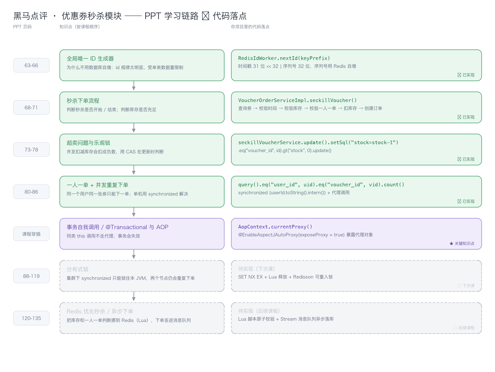

七行对应课程顺序，绿色是本次课已经写完的，紫色是穿插进来的关键知识点（事务自调用），灰色是下次课和后续课程的内容。右边一列是这块知识落在哪个方法上。

代码集中在两个文件：

- `VoucherOrderController` → `VoucherOrderServiceImpl`：秒杀下单的主流程
- `RedisIdWorker`：全局唯一 ID 生成器

一些关键属性是什么，一定要搞清，不然看代码脑壳疼：

- voucherId：秒杀券的 id，一类秒杀券只有一个 voucherId
- orderId：根据 RedisIdWorker 工具类的规则生成的订单 Id
- userId：用户 id，藏在 ThreadLocal 中，可以通过 UserHolder 工具类获取


---

## 二、秒杀下单流程

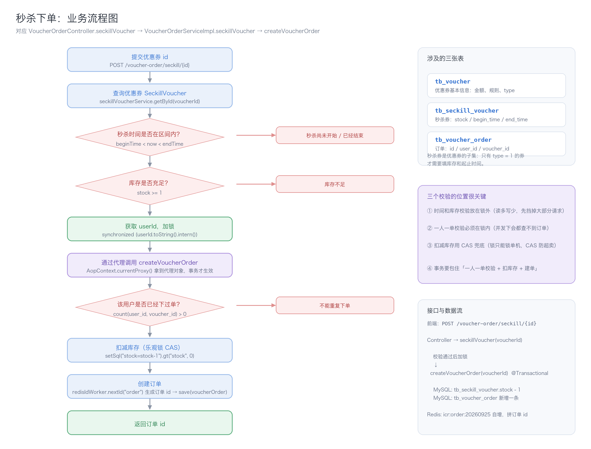

**三张表的配合**：`tb_voucher` 存券的基本信息，`tb_seckill_voucher` 是秒杀券的扩展（库存、开始时间、结束时间），`tb_voucher_order` 是订单。秒杀券是优惠券的子集，只有 `type = 1` 的券才需要填库存和起止时间。

**接口**：`POST /voucher-order/seckill/{id}`，返回订单 id。

**主流程代码**（`VoucherOrderServiceImpl.seckillVoucher`）：

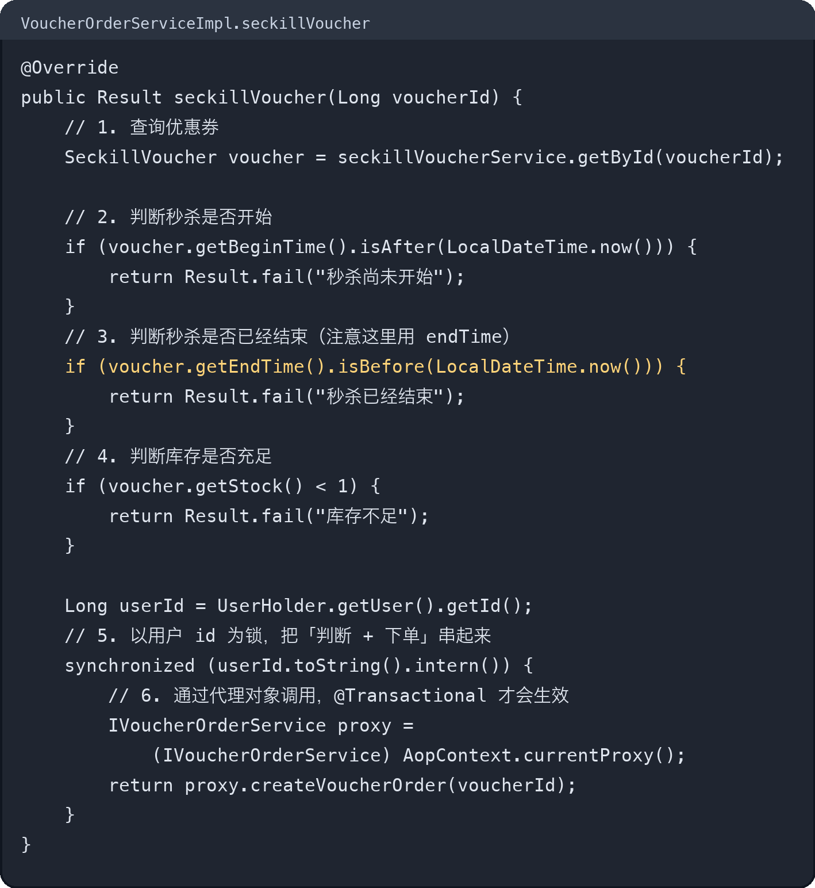


对方法createVoucherOrder()的解析在后面

**流程里三个校验的位置很讲究**：

1. **秒杀时间校验、库存校验放在锁外。** 这两个是"读多写少"的快速判断，能让绝大部分无效请求在加锁之前就被挡回去，锁的竞争压力小很多。
2. **一人一单校验必须放在锁内。** 它是"先查再写"的组合，并发下两个线程可能都查不到订单，所以必须串行化。
3. **扣减库存除了锁，还要用 CAS 兜底。** 锁只能锁单机，CAS 是数据库层面的最后一道防线。

2 描述的锁和 3 描述的 CAS 职责是不一样的：锁是保证让同一个用户的请求串行执行，保证**一人一单**；而 CAS 是保证防止库存变成负数，解决**多用户并发导致的库存超卖**。（createVoucherOrder）

CAS：更新数据之前先对比，只有数据库里的值和我读到的旧值一致，才允许修改；不一致就更新失败，不做任何改动。

---

## 三、全局唯一 ID：订单号为什么不能自增

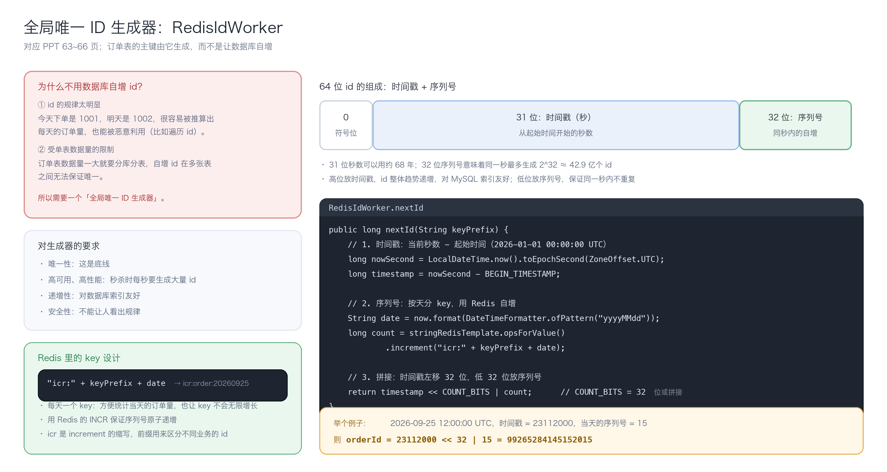

**为什么不用数据库自增**：一是规律太明显，今天 1001、明天 1002，订单量能被推算出来，id 也容易被遍历利用；二是受单表数据量限制，订单表早晚要分库分表，自增 id 在多表之间无法保证唯一。

**64 位 id 的组成**：1 位符号位（恒为 0，保证正数）+ 31 位时间戳（秒）+ 32 位序列号。31 位秒数够用约 68 年，32 位序列号意味着同一秒最多能有 42.9 亿个 id。高位放时间戳，id 整体趋势递增，对 MySQL 索引友好；低位放序列号，保证同一秒内不重复。

**Redis 的两个作用**：

- 用 `INCR` 生成序列号，天然原子，不用担心并发
- key 按天切分（`icr:order:20260925`），一方面方便统计当天订单量，另一方面避免单个 key 无限增长

**拼接靠位运算**：`timestamp << 32 | count`。左移 32 位把时间戳挪到高位，低位全 0，再用按位或把序列号填进去。图里给了一个真实算例。

**完整代码**（`RedisIdWorker`）：

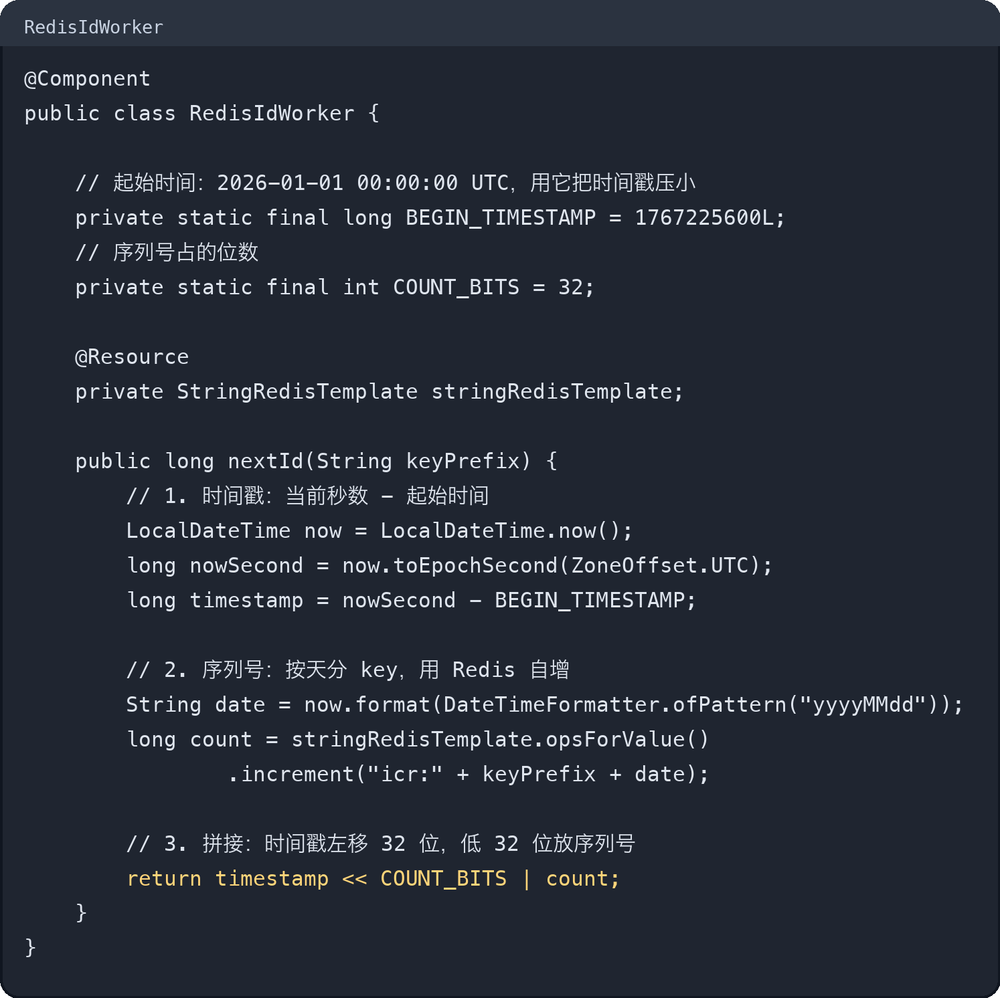

调用方只需要一行：`long orderId = redisIdWorker.nextId("order");`。

---

## 四、超卖：两个线程同时扣库存

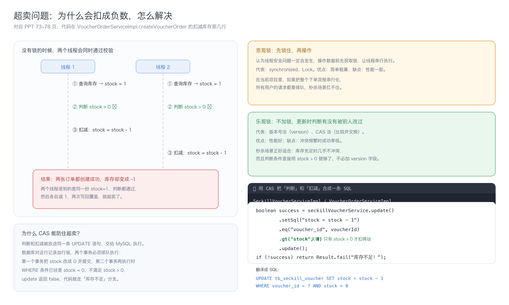

**问题怎么发生的**：库存只有 1 件，两个线程几乎同时进来，都查到 `stock = 1`，都判断 `stock > 0` 成立，然后各自减 1 写回。两次写回互相覆盖，最终库存变成 -1，却成功创建了两张订单。

**两条思路**：

- **悲观锁**：操作前先加锁，让线程串行执行。`synchronized`、`Lock` 都属于这一类。简单粗暴，但秒杀场景下把整个下单流程串行化，性能扛不住。
- **乐观锁**：不加锁，更新的时候判断数据有没有被别人改过。常见两种实现，版本号法和 CAS 法。性能好，代价是冲突频繁时成功率低。

**这个场景用 CAS 最合适**：不必额外加 `version` 字段，直接把业务条件 `stock > 0` 当判断条件，用一条 UPDATE 同时完成"判断"和"扣减"：

- 先把 `stock = stock - 1` 写进 `setSql`
- 再用 `gt("stock", 0)` 拼出 `WHERE stock > 0`
- `update()` 返回布尔值，false 就说明被人抢先了，返回"库存不足"

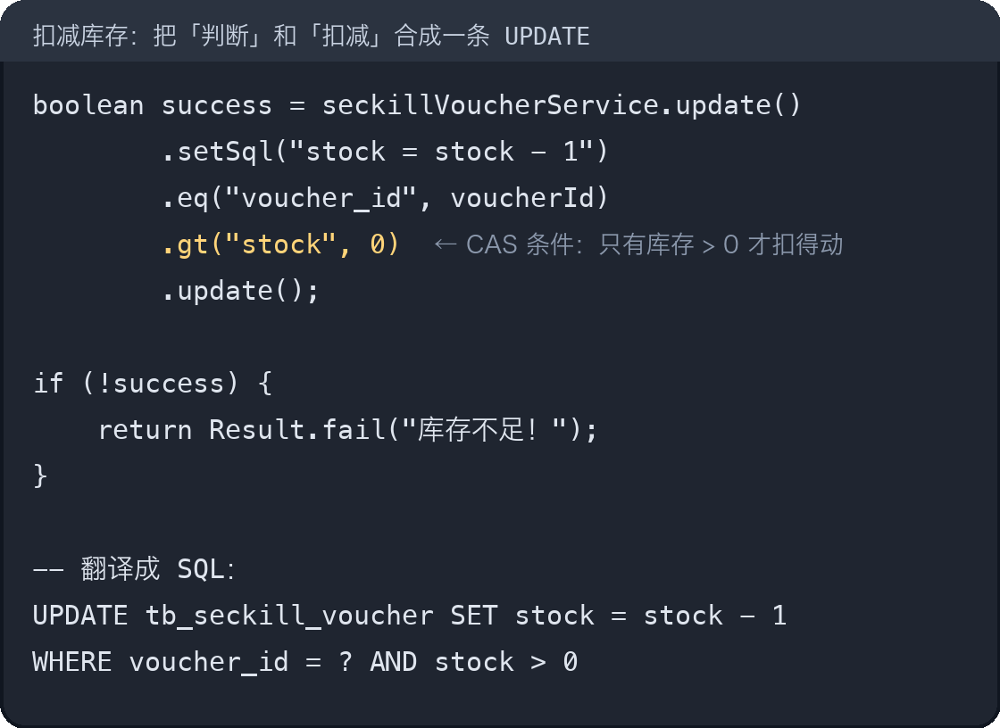

数据库执行这条语句时会对该行加行锁，两个事务排队执行：第一个把 stock 改成 0 并提交，第二个再执行时 `WHERE stock > 0` 已经不成立，更新 0 行，返回 false。**判断和扣减在一条 SQL 里，中间没有空隙，这就是它能防住超卖的原因。**

---

## 五、一人一单：校验为什么会被并发穿透

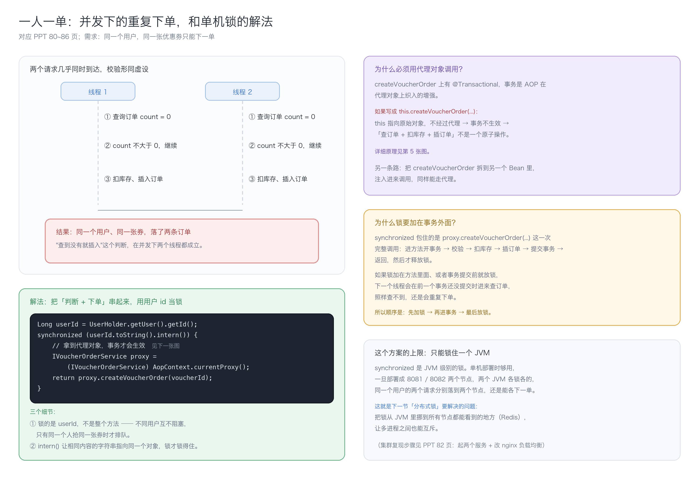

**需求**：同一个用户、同一张券，只能下一单。

**并发下的漏洞**：两个请求同时到达，都执行"查询该用户该券的订单数"，都得到 0，都认为可以下单，于是都插入了订单。这是典型的"先检查后执行"竞态。

**解法**：把"判断 + 下单"这段串起来，用**用户 id 作为锁对象**：

- 锁的是 `userId`，不是整个方法。这样不同用户之间互不阻塞，只有同一个人抢同一张券时才排队
- 用 `userId.toString().intern()` 让内容相同的字符串指向同一个对象。如果不 `intern()`，两个线程里的字符串对象不是同一个，`synchronized` 根本锁不住
- 锁包住的必须是**通过代理调用的整个下单方法**，而不是方法内部的某几行

**完整代码**（`VoucherOrderServiceImpl.createVoucherOrder`）：

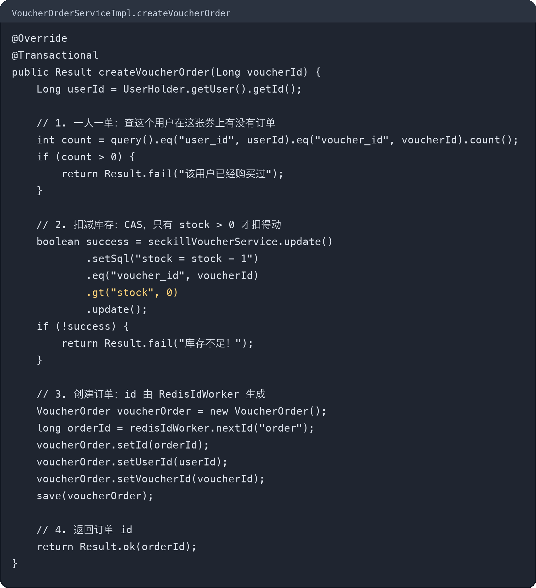

public class VoucherOrderServiceImpl extends ServiceImpl<VoucherOrderMapper, VoucherOrder> implements IVoucherOrderService ....
从这里可以看出来，query()..... 和 save() 通过 Mybatis-plus 实现的，因为是 this 是 Service 对象（VoucherOrderServiceImpl 实例），会去查询或者操纵 VoucherOrder

**为什么必须用代理对象调用**：`createVoucherOrder` 上有 `@Transactional`，而事务是 AOP 在代理对象上织入的增强。写成 `this.createVoucherOrder(...)` 时，`this` 指向原始对象，不经过代理，事务直接失效。这一点下一节单独展开。

---

## 六、`@Transactional` 与 AOP 代理：`this` 调用为什么会失效

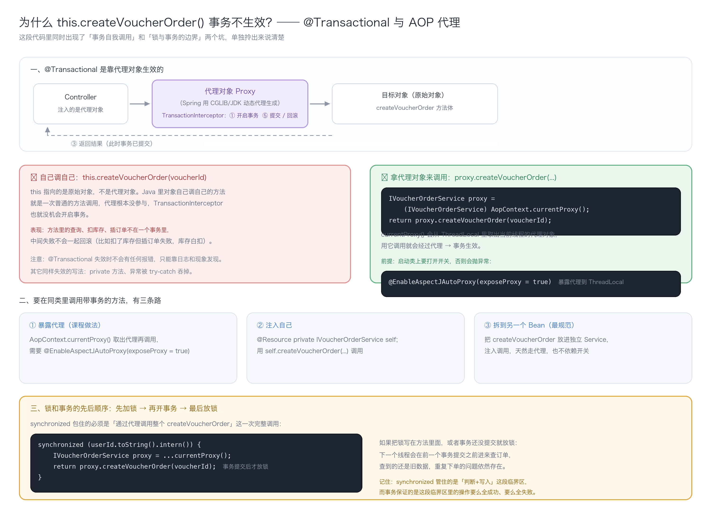

这是这一章里最容易出错、也最值得单独记下来的一个知识点。

### 6.1 事务是怎么生效的

Spring 启动时会给 `VoucherOrderServiceImpl` 生成一个**代理对象**，Controller 里注入的、以及 `AopContext.currentProxy()` 拿到的，都是这个代理。调用链是：

```
外部调用 → 代理对象 → TransactionInterceptor（开启事务）→ 目标对象的方法 → 提交 / 回滚
```

事务的开启和提交都发生在**代理这一层**，目标方法只是被包在中间执行。

### 6.2 为什么 `this` 调用不行

`this` 指向的是**原始对象**，不是代理。对象自己调自己的方法在 Java 里就是一次普通方法调用，代理完全没有参与，事务拦截器没有机会执行，方法里的查询、扣库存、插订单就不在一个事务里。

麻烦的是**它不会报错**：代码照样跑通，只有在"扣了库存但插订单失败"这类中途异常时，才会发现数据没回滚。

### 6.3 三种解决办法

1. **暴露代理（课程做法）**：`AopContext.currentProxy()` 从 ThreadLocal 里取出当前线程的代理对象，用它调用。前提是启动类上加了 `@EnableAspectJAutoProxy(exposeProxy = true)`，不加这行会直接抛异常。
2. **注入自己**：`@Resource private IVoucherOrderService self;`，用 `self.createVoucherOrder(...)` 调用。
3. **拆到另一个 Bean（最规范）**：把 `createVoucherOrder` 挪进一个独立的 Service，注入后调用。天然走代理，也不依赖开关。

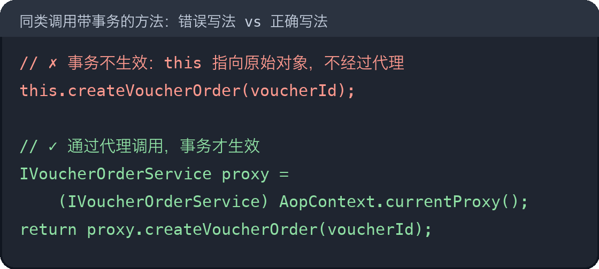

暴露代理的开关加在启动类上：

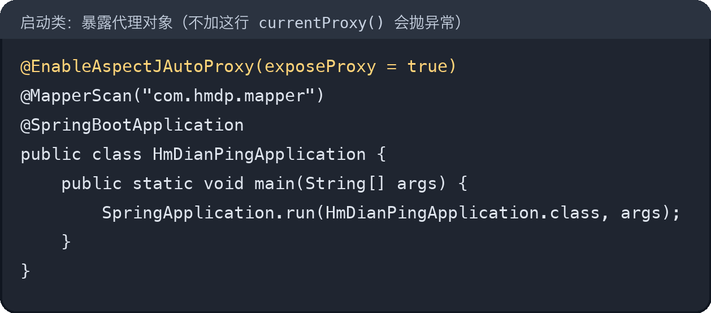

### 6.4 锁和事务的先后顺序

顺序必须是：**先加锁 → 再开事务 → 最后放锁**。

`synchronized` 要包住"通过代理调用整个 `createVoucherOrder`"这一次完整调用，这样事务提交之后才会释放锁。如果把锁写在方法里面，或者事务还没提交就放锁，下一个线程会在前一个事务提交之前进来查订单，查到的还是旧数据，重复下单的问题依然存在。

一句话记住分工：**`synchronized` 管的是"判断 + 写入"这段临界区不被并发穿插，事务管的是这段临界区里的操作要么全成功、要么全失败。**

---

## 七、下一步：为什么单机锁不够用

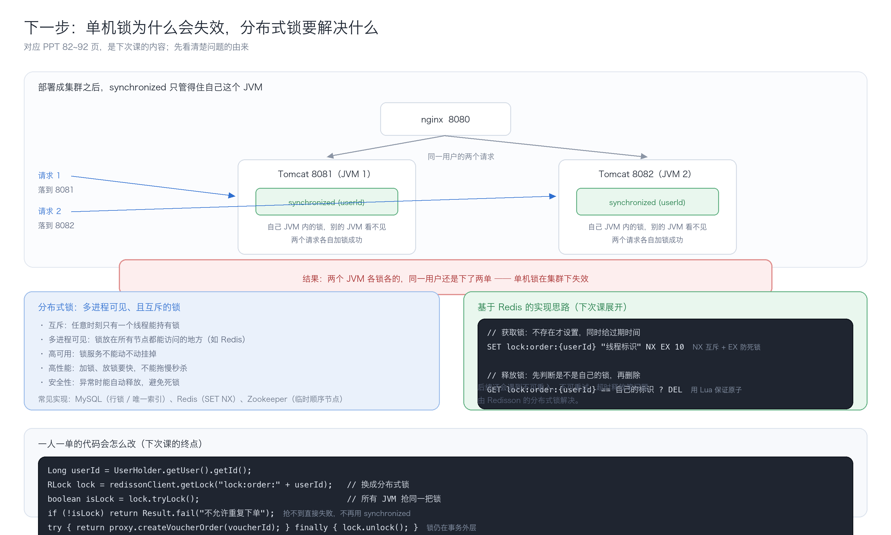

` synchronized` 是 **JVM 级别的锁**。单机部署时它能保证同一个用户只有一个线程进入临界区；一旦按 PPT 82 页那样部署成 8081、8082 两个节点，nginx 把同一个用户的两个请求分别转发到两个 JVM，**两个 JVM 各锁各的，谁也看不见谁**，重复下单的问题又回来了。解决方案是后面课程会提到的分布式锁。

---

## 八、文件地图

| 文件                          | 这一章新增/改动的内容                                                |
| --------------------------- | ---------------------------------------------------------- |
| `VoucherController`         | 新增秒杀券接口：保存券的同时保存秒杀信息（`tb_voucher` + `tb_seckill_voucher`）  |
| `VoucherOrderController`    | 秒杀下单入口：`POST /voucher-order/seckill/{id}`                  |
| `VoucherOrderServiceImpl`   | 主流程：校验时间和库存 → 加锁 → 校验一人一单 → CAS 扣库存 → 生成订单                 |
| `RedisIdWorker`             | 全局唯一 ID：时间戳 + Redis 自增序列号                                  |
| `SeckillVoucherServiceImpl` | 继承 MyBatis-Plus 的 `ServiceImpl`，本身没有额外代码                   |
| 启动类                         | 加了 `@EnableAspectJAutoProxy(exposeProxy = true)`，为事务自调用做准备 |
